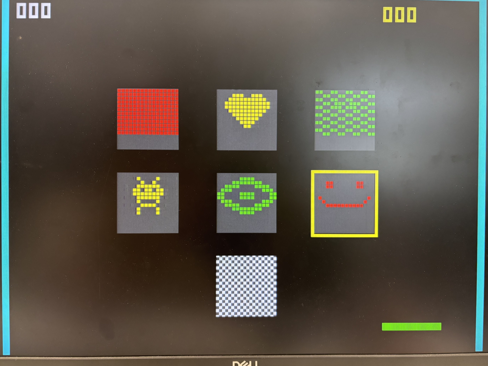
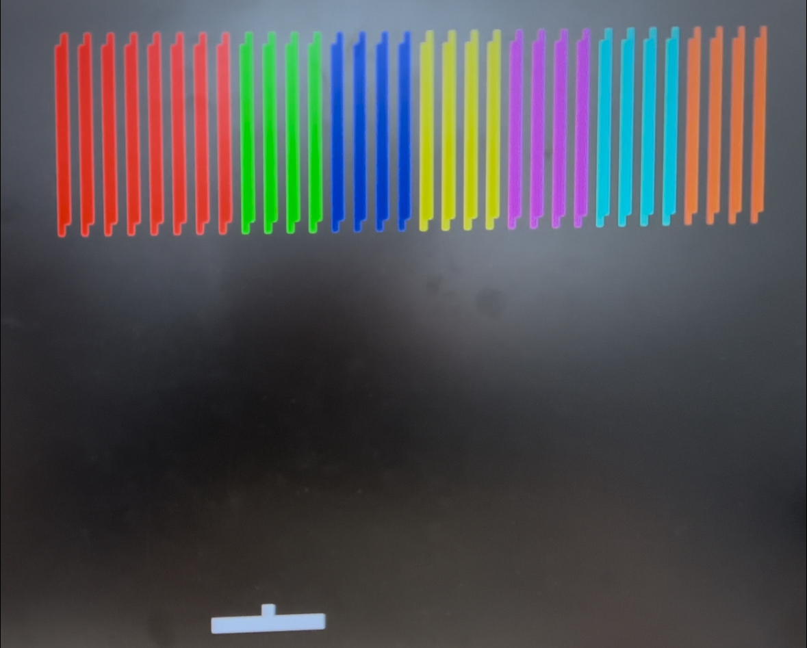
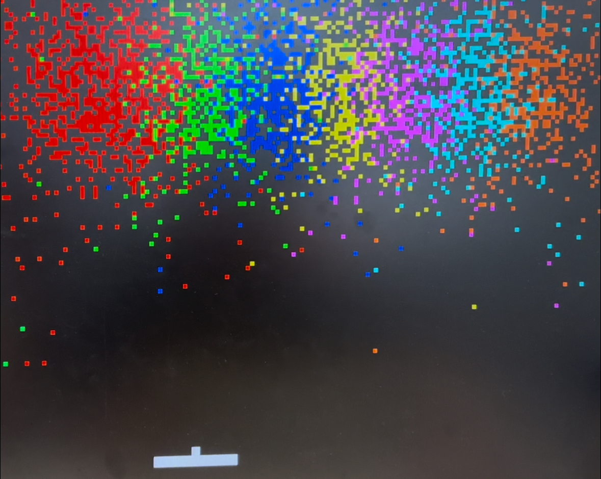
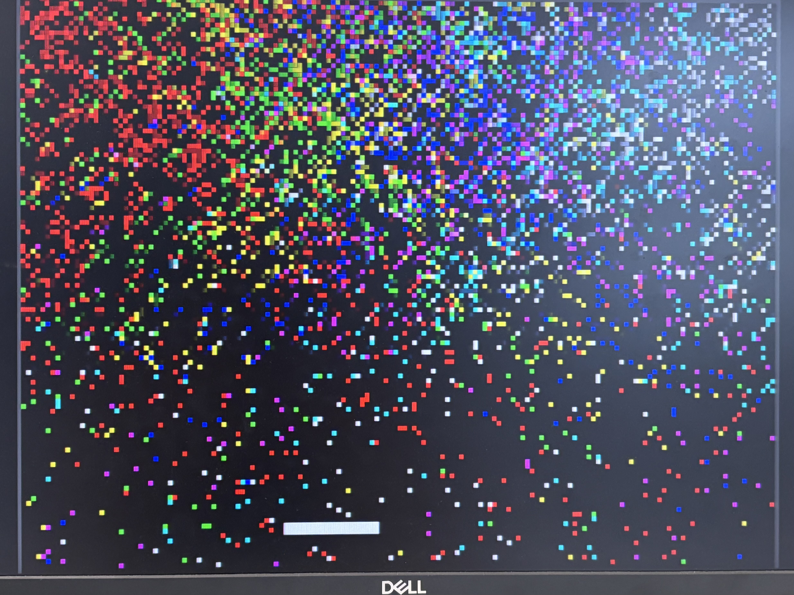

# Hardware-Accelerated Breakout 🧱

> A real-time Breakout game on FPGA — scaling from a classic brick grid to a **4096-object hardware physics mode** implemented with BRAM-backed spatial occupancy and a 50 MHz update FSM.

A Breakout game implemented in **Verilog / SystemVerilog** on the **Terasic DE2-115 (Intel Cyclone IV E)** FPGA board. The display is driven over **VGA**, audio is played through the on-board **WM8731 codec (I²S)**, and the paddle is controlled with a **PS/2 mouse**.

The headline achievement is a **4096-brick "extreme physics" mode**. Each object stores its own color, velocity direction, and grid position in a 20-bit state word. A **50 MHz three-stage update FSM** walks all 4096 objects, probes a RAM-backed occupancy grid for collisions, writes the next state into the back buffer, and swaps buffers after the pass. VGA reads the active buffer directly, so rendering and physics are decoupled without an external frame buffer.

*National Taiwan University — Digital Circuit Lab, Final Project · Team 10: Yen-Fu Huang, Hao-Hsuan Hsieh, Chen-Min Lin*

---

## 🎮 Demo

All screenshots are captured from real hardware (DE2-115 → VGA monitor).

**Level select — custom brick layouts (heart, smiley, space invader, and more):**



**Classic mode — a clean, ordered brick grid:**



**Extreme physics mode — 4096 independently stored brick states, updated by the hardware FSM:**





> The "spray" is not a pre-rendered particle effect: each coloured cell corresponds to one brick state held in FPGA memory and updated by the hardware FSM.

---

## ✨ Highlights

- **4096-brick extreme mode** — VGA `pixel_x / pixel_y` are bit-truncated (`{pixel_y[8:2], pixel_x[9:2]}`) and used as the occupancy-buffer address. The 3-bit color code is mapped to 24-bit RGB, avoiding a separate external frame-buffer controller.
- **Ping-pong occupancy buffers** — Two synthesizable dual-port RAM blocks act as front/back grids. VGA reads the active grid while the physics FSM writes the next grid, then `active_grid` swaps after the update pass.
- **Multi-clock-domain design** — VGA rendering at 25 MHz, the physics engine at 50 MHz, and the audio subsystem on `AUD_BCLK`, decoupling rendering from computation in hardware.
- **Mode isolation at the top level** — `click` is masked with the mode switch before entering each game core, preventing the inactive module from reacting to user input.
- **Hardware audio** — Collision and brick-break events raise a `snd_trig` flag that drives an I²S audio subsystem (reused from Lab 3) into the WM8731 codec.
- **Dual game modes** — A classic mode and the extreme-physics mode, toggled with `SW[11]`, with top-level input masking so the inactive module can't interfere.

---

## 🛠️ Hardware

| Item | Specification |
|------|---------------|
| FPGA board | Terasic **DE2-115** (Intel/Altera Cyclone IV E, `EP4CE115F29C7`) |
| Display | VGA monitor (640×480 @ 60 Hz) |
| Input | **PS/2 mouse** |
| Audio | On-board WM8731 audio codec + speaker/headphones |
| Toolchain | **Intel Quartus Prime** (18.1 Lite or newer recommended) |

---

## 🎮 Controls

| Action | Input |
|--------|-------|
| Move paddle | Move the mouse left / right |
| Launch ball | Left mouse button |
| Switch game mode | Toggle `SW[11]` |
| Reset game | Press `KEY[0]` |

---

## 🧩 System Architecture

```
                 ┌──────────────┐
   CLK 50MHz ───►│  PLL / I2C   │
                 └──────────────┘
   CLK 50MHz ───►┌──────────────────────────┐
                 │  Physics Engine (FSM)    │◄──► Brick State Registers
                 │  P_IDLE → P_CLEAR_BG →   │
                 │  P_UPD_0/1/2 → P_SWAP    │◄──► TDP BRAM A / BRAM B
                 └──────────────────────────┘        (Ping-Pong Buffer)
                          │ snd_trig                       │ Port A
                          ▼                                ▼ pixel_x/y
                 ┌──────────────┐   25MHz   ┌──────────────────────┐
                 │  Audio (I2S) │           │  VGA Controller +    │──► VGA DAC
                 │  → WM8731    │           │  RGB Multiplexer     │
                 └──────────────┘           └──────────────────────┘
```

**Physics engine pipeline (FSM):**
`P_IDLE` (wait for VGA frame tick; update starts every second tick) →
`P_CLEAR_BG` (clear 32,768 occupancy cells) →
`P_UPD_0` Fetch → `P_UPD_1` Address → `P_UPD_2` Collide & Write-back for brick 0…4095 →
`P_SWAP` (swap front/back buffers).

At 50 MHz, the steady-state pass is analytically bounded by about **45,057 cycles ≈ 0.90 ms**: 32,768 cycles to clear the back grid, 3×4096 cycles to process all bricks, plus the swap. This is comfortably below the ~33 ms interval between physics updates when running every two 60 Hz frames.

In `P_UPD_2`, a non-zero readout from the front-buffer BRAM signals a spatial-hash collision with another brick; combined with the ball-collision latch, the brick is either cleared (written as `3'd0`) or has its velocity vector reflected and its new position written back.

The timing figure above is derived directly from the checked-in FSM and counter bounds in `src/breakout_top.v`; no post-route timing report is included in this repository.

---

## 📐 Verifiable design facts

These numbers come directly from the checked-in RTL rather than from an external synthesis report:

| Item | RTL-backed value |
|---|---:|
| Brick states | 4096 |
| State bits per brick | 20 bits (`color[2:0]`, `dy`, `dx`, `y[6:0]`, `x[7:0]`) |
| Occupancy-grid address width | 15 bits |
| Occupancy cells per buffer | 32,768 |
| Occupancy-buffer payload | 3 bits/cell |
| Physics clock | 50 MHz |
| VGA pixel clock | 25 MHz |
| Update pipeline | 3 FSM stages per brick |
| Brick-update cycles | 12,288 cycles |
| Back-grid clear cycles | 32,768 cycles |
| Approx. full physics pass | 45,057 cycles ≈ 0.90 ms |
| Physics cadence | every 2 VGA frame ticks |

Two important clarifications for reviewers:

1. **4096 bricks are independently stored, but not updated in 4096-way parallel.** The architecture uses one pipelined FSM that iterates over the 4096 states.
2. The RAM modules are written in synthesizable dual-port style. Exact M9K/LUT utilization and Fmax require a Quartus compilation report; those reports are not currently committed here.

---

## ⚙️ Engineering Challenges Solved

This section captures the real hardware-design problems encountered and how they were resolved — the parts I learned the most from.

- **Avoiding a 4096-way combinational datapath.** The implemented design serializes object updates through a three-state 50 MHz FSM and uses RAM-backed spatial occupancy instead of evaluating all object collisions in one giant combinational expression. This trades a small, deterministic update time for far lower routing pressure.
- **Ghost inputs across game modules.** After integrating two game modules, the mouse `click` signal reached both, so the background module silently ran and triggered a false Game Over. **Fix:** hardware input masking at the top level (e.g. `click & ~switch`) to fully isolate the inactive module.

---

## 📂 File Structure

```
.
├── README.md
├── LICENSE
├── .gitignore
├── docs/
│   └── images/                # Real-hardware demo screenshots
└── src/
    ├── breakout_top.v         # Main game module (physics engine + TDP BRAM)
    ├── interface.sv           # Top-level integration: mode switching & input masking
    ├── vga_controller.v       # VGA timing controller
    ├── DE2_115/               # Board-level top & pin constraints
    │   ├── DE2_115.sv         # Board top (PS/2 mouse, VGA, audio pins)
    │   ├── DE2_115.qsf        # Quartus pin / settings
    │   ├── DE2_115.sdc        # Timing constraints
    │   ├── Debounce.sv
    │   └── SevenHexDecoder.sv
    └── sound/                 # Audio subsystem (adapted from Lab 3)
        ├── *_rom/             # Per-sound ROM IP
        ├── src/               # AudDSP / AudPlayer / I2C init / IP cores
        ├── *.mif / *.wav / *.raw
        └── mif_gen*.py        # Scripts that generate .mif from audio files
```

---

## 🚀 Build & Flash

> Because the IP cores and some paths are tied to the Quartus environment, the most reliable approach is to recreate the project in Quartus and add the source files.

1. Open **Quartus Prime**, create a new project, and select the device **Cyclone IV E `EP4CE115F29C7`** (DE2-115).
2. Add the `.v` / `.sv` files under `src/` to the project and set **`DE2_115`** as the top-level entity.
3. Import constraints: `Assignments → Import Assignments`, choose `src/DE2_115/DE2_115.qsf`; add `DE2_115.sdc` for timing.
4. Regenerate the IP under `src/sound/` (`*_rom`, `audio_rom`, `lab3_qsys`, etc.), or reuse the included `.qip` / `.mif` files.
5. `Processing → Start Compilation`.
6. `Tools → Programmer`, connect the DE2-115, and flash `output_files/*.sof`.
7. Connect a VGA monitor and a PS/2 mouse, then power on to play.

### Regenerating audio `.mif`

```bash
cd src/sound
python3 mif_gen.py        # Converts .wav/.raw into .mif per the script's settings
```

---

## 👥 Team

Team 10 — Yen-Fu Huang, Hao-Hsuan Hsieh, Chen-Min Lin

## 📄 License

Released under the [MIT License](LICENSE). Feel free to reference and learn from it.